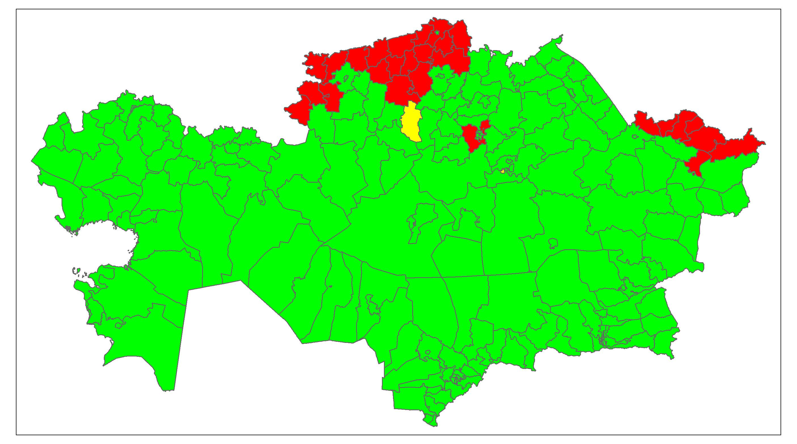

# Natural-Growth-Kazakhstan

I have created a map of natural population growth in the regions of Kazakhstan for 2023.

I developed this visualization using the R programming language and the following libraries: devtools, geokz, dplyr, sf, tmap.

❤️ Red - population decline 
💛 Yellow - stable population
💚 Green - population growth 

188 districts showed a positive increase, which indicates a higher number of births compared to the number of deaths.
29 districts experienced population decline, where the number of deaths exceeded the number of births.
In 2 districts, the population remained stable with an equal number of births and deaths.

The area with the highest population growth is Karatau (Shymkent), where the increase amounted to 8,947 people. The area with the maximum population loss is Altai (East Kazakhstan), where the loss was 456 people. ​

The districts in which the population has remained unchanged are Zhaksy (Akmola region) and Shakhtinsk (Karagandy region).

